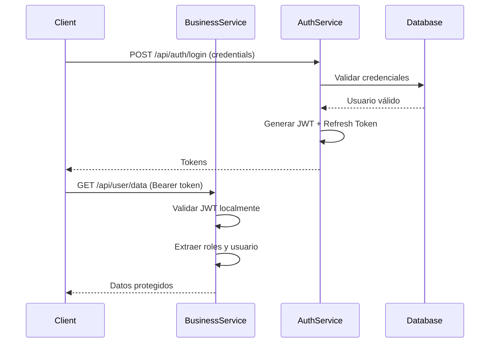

# Implementación de Seguridad Centralizada con JWT

## Historia de Usuario Principal

**Como** desarrollador de la plataforma  
**Quiero** implementar un sistema de autenticación y autorización centralizado basado en JWT  
**Para** proteger los endpoints de los microservicios y gestionar el acceso de forma unificada

---

## Épica: Sistema de Autenticación y Autorización

### HU-001: Creación del Microservicio de Autenticación

**Prioridad**: Alta  
**Estimación**: 8 puntos

#### Descripción
Crear un microservicio independiente que gestione la autenticación de usuarios y la generación de tokens JWT.

#### Criterios de Aceptación
- [ ] El microservicio debe exponer un endpoint `/api/auth/login` que reciba credenciales y retorne un token JWT
- [ ] El token JWT debe incluir información del usuario (username, roles)
- [ ] El token debe tener un tiempo de expiración configurable
- [ ] El microservicio debe exponer un endpoint `/api/auth/validate` para validar tokens
- [ ] El microservicio debe exponer un endpoint `/api/auth/refresh` para renovar tokens
- [ ] Los tokens deben firmarse con un secreto configurable
- [ ] Debe manejar errores de autenticación con mensajes internacionalizados

#### Tareas Técnicas

##### 1.1 Configurar Dependencias
```gradle
// build.gradle del módulo auth-service
dependencies {
    implementation 'org.springframework.boot:spring-boot-starter-security'
    implementation 'org.springframework.boot:spring-boot-starter-web'
    implementation 'org.springframework.boot:spring-boot-starter-data-jpa'
    
    // JWT
    implementation 'io.jsonwebtoken:jjwt-api:0.11.5'
    runtimeOnly 'io.jsonwebtoken:jjwt-impl:0.11.5'
    runtimeOnly 'io.jsonwebtoken:jjwt-jackson:0.11.5'
    
    // Validación
    implementation 'org.springframework.boot:spring-boot-starter-validation'
}
```

##### 1.2 DTOs de Entrada y Salida

**LoginRequest.java**
```java
package com.empresa.auth.application.dto;

import jakarta.validation.constraints.NotBlank;
import lombok.Data;

@Data
public class LoginRequest {
    @NotBlank(message = "{auth.username.required}")
    private String username;
    
    @NotBlank(message = "{auth.password.required}")
    private String password;
}
```

**AuthResponse.java**
```java
package com.empresa.auth.application.dto;

import lombok.AllArgsConstructor;
import lombok.Builder;
import lombok.Data;
import lombok.NoArgsConstructor;

@Data
@Builder
@NoArgsConstructor
@AllArgsConstructor
public class AuthResponse {
    private String token;
    private String refreshToken;
    private String tokenType = "Bearer";
    private Long expiresIn;
    private String username;
    private List<String> roles;
}
```

**ValidateTokenRequest.java**
```java
package com.empresa.auth.application.dto;

import jakarta.validation.constraints.NotBlank;
import lombok.AllArgsConstructor;
import lombok.Data;
import lombok.NoArgsConstructor;

@Data
@NoArgsConstructor
@AllArgsConstructor
public class ValidateTokenRequest {
    @NotBlank(message = "{auth.token.required}")
    private String token;
}
```

**ValidateTokenResponse.java**
```java
package com.empresa.auth.application.dto;

import lombok.AllArgsConstructor;
import lombok.Builder;
import lombok.Data;
import lombok.NoArgsConstructor;

import java.util.List;

@Data
@Builder
@NoArgsConstructor
@AllArgsConstructor
public class ValidateTokenResponse {
    private boolean valid;
    private String username;
    private List<String> roles;
    private String message;
}
```

**RefreshTokenRequest.java**
```java
package com.empresa.auth.application.dto;

import jakarta.validation.constraints.NotBlank;
import lombok.Data;

@Data
public class RefreshTokenRequest {
    @NotBlank(message = "{auth.refreshToken.required}")
    private String refreshToken;
}
```

##### 1.3 Servicio de JWT

**JwtService.java**
```java
package com.empresa.auth.domain.service;

import io.jsonwebtoken.Claims;
import io.jsonwebtoken.JwtException;
import io.jsonwebtoken.Jwts;
import io.jsonwebtoken.SignatureAlgorithm;
import io.jsonwebtoken.security.Keys;
import org.springframework.beans.factory.annotation.Value;
import org.springframework.security.core.GrantedAuthority;
import org.springframework.security.core.userdetails.UserDetails;
import org.springframework.stereotype.Service;

import java.security.Key;
import java.util.Date;
import java.util.HashMap;
import java.util.List;
import java.util.Map;
import java.util.stream.Collectors;

@Service
public class JwtService {

    @Value("${jwt.secret}")
    private String secret;

    @Value("${jwt.expiration}")
    private Long expiration;

    @Value("${jwt.refresh.expiration}")
    private Long refreshExpiration;

    private Key getSigningKey() {
        return Keys.hmacShaKeyFor(secret.getBytes());
    }

    public String generateToken(UserDetails userDetails) {
        Map<String, Object> claims = new HashMap<>();
        claims.put("roles", userDetails.getAuthorities().stream()
                .map(GrantedAuthority::getAuthority)
                .collect(Collectors.toList()));
        
        return buildToken(claims, userDetails.getUsername(), expiration);
    }

    public String generateRefreshToken(UserDetails userDetails) {
        Map<String, Object> claims = new HashMap<>();
        return buildToken(claims, userDetails.getUsername(), refreshExpiration);
    }

    private String buildToken(Map<String, Object> claims, String subject, Long expiration) {
        return Jwts.builder()
                .setClaims(claims)
                .setSubject(subject)
                .setIssuedAt(new Date())
                .setExpiration(new Date(System.currentTimeMillis() + expiration))
                .signWith(getSigningKey(), SignatureAlgorithm.HS256)
                .compact();
    }

    public boolean validateToken(String token) {
        try {
            Jwts.parserBuilder()
                    .setSigningKey(getSigningKey())
                    .build()
                    .parseClaimsJws(token);
            return true;
        } catch (JwtException | IllegalArgumentException e) {
            return false;
        }
    }

    public String getUsernameFromToken(String token) {
        return getClaims(token).getSubject();
    }

    public List<String> getRolesFromToken(String token) {
        Claims claims = getClaims(token);
        return (List<String>) claims.get("roles");
    }

    private Claims getClaims(String token) {
        return Jwts.parserBuilder()
                .setSigningKey(getSigningKey())
                .build()
                .parseClaimsJws(token)
                .getBody();
    }

    public boolean isTokenExpired(String token) {
        try {
            return getClaims(token).getExpiration().before(new Date());
        } catch (JwtException e) {
            return true;
        }
    }
}
```

##### 1.4 Servicio de Autenticación

**AuthService.java**
```java
package com.empresa.auth.domain.service;

import com.empresa.auth.application.dto.*;
import com.empresa.auth.domain.exception.InvalidCredentialsException;
import com.empresa.auth.domain.exception.InvalidTokenException;
import org.springframework.security.authentication.AuthenticationManager;
import org.springframework.security.authentication.UsernamePasswordAuthenticationToken;
import org.springframework.security.core.Authentication;
import org.springframework.security.core.userdetails.UserDetails;
import org.springframework.security.core.userdetails.UserDetailsService;
import org.springframework.stereotype.Service;

import java.util.stream.Collectors;

@Service
public class AuthService {

    private final AuthenticationManager authenticationManager;
    private final JwtService jwtService;
    private final UserDetailsService userDetailsService;

    public AuthService(AuthenticationManager authenticationManager,
                      JwtService jwtService,
                      UserDetailsService userDetailsService) {
        this.authenticationManager = authenticationManager;
        this.jwtService = jwtService;
        this.userDetailsService = userDetailsService;
    }

    public AuthResponse authenticate(LoginRequest request) {
        try {
            Authentication authentication = authenticationManager.authenticate(
                    new UsernamePasswordAuthenticationToken(
                            request.getUsername(),
                            request.getPassword()
                    )
            );

            UserDetails userDetails = (UserDetails) authentication.getPrincipal();
            String token = jwtService.generateToken(userDetails);
            String refreshToken = jwtService.generateRefreshToken(userDetails);

            return AuthResponse.builder()
                    .token(token)
                    .refreshToken(refreshToken)
                    .tokenType("Bearer")
                    .expiresIn(jwtService.getExpiration())
                    .username(userDetails.getUsername())
                    .roles(userDetails.getAuthorities().stream()
                            .map(auth -> auth.getAuthority())
                            .collect(Collectors.toList()))
                    .build();
        } catch (Exception e) {
            throw new InvalidCredentialsException("auth.invalid.credentials");
        }
    }

    public ValidateTokenResponse validateToken(String token) {
        try {
            if (jwtService.validateToken(token)) {
                String username = jwtService.getUsernameFromToken(token);
                List<String> roles = jwtService.getRolesFromToken(token);

                return ValidateTokenResponse.builder()
                        .valid(true)
                        .username(username)
                        .roles(roles)
                        .message("Token válido")
                        .build();
            } else {
                return ValidateTokenResponse.builder()
                        .valid(false)
                        .message("Token inválido")
                        .build();
            }
        } catch (Exception e) {
            throw new InvalidTokenException("auth.invalid.token");
        }
    }

    public AuthResponse refreshToken(RefreshTokenRequest request) {
        try {
            if (!jwtService.validateToken(request.getRefreshToken())) {
                throw new InvalidTokenException("auth.invalid.refresh.token");
            }

            String username = jwtService.getUsernameFromToken(request.getRefreshToken());
            UserDetails userDetails = userDetailsService.loadUserByUsername(username);

            String newToken = jwtService.generateToken(userDetails);
            String newRefreshToken = jwtService.generateRefreshToken(userDetails);

            return AuthResponse.builder()
                    .token(newToken)
                    .refreshToken(newRefreshToken)
                    .tokenType("Bearer")
                    .expiresIn(jwtService.getExpiration())
                    .username(userDetails.getUsername())
                    .roles(userDetails.getAuthorities().stream()
                            .map(auth -> auth.getAuthority())
                            .collect(Collectors.toList()))
                    .build();
        } catch (Exception e) {
            throw new InvalidTokenException("auth.refresh.failed");
        }
    }
}
```

##### 1.5 Controlador de Autenticación

**AuthController.java**
```java
package com.empresa.auth.infrastructure.controller;

import com.empresa.auth.application.dto.*;
import com.empresa.auth.domain.service.AuthService;
import io.swagger.v3.oas.annotations.Operation;
import io.swagger.v3.oas.annotations.tags.Tag;
import jakarta.validation.Valid;
import org.springframework.http.ResponseEntity;
import org.springframework.web.bind.annotation.*;

@RestController
@RequestMapping("/api/auth")
@Tag(name = "Autenticación", description = "Endpoints para autenticación y autorización")
public class AuthController {

    private final AuthService authService;

    public AuthController(AuthService authService) {
        this.authService = authService;
    }

    @PostMapping("/login")
    @Operation(summary = "Autenticar usuario", description = "Autentica un usuario y retorna un token JWT")
    public ResponseEntity<AuthResponse> login(@Valid @RequestBody LoginRequest request) {
        AuthResponse response = authService.authenticate(request);
        return ResponseEntity.ok(response);
    }

    @PostMapping("/validate")
    @Operation(summary = "Validar token", description = "Valida un token JWT y retorna información del usuario")
    public ResponseEntity<ValidateTokenResponse> validateToken(
            @Valid @RequestBody ValidateTokenRequest request) {
        ValidateTokenResponse response = authService.validateToken(request.getToken());
        return ResponseEntity.ok(response);
    }

    @PostMapping("/refresh")
    @Operation(summary = "Renovar token", description = "Renueva un token JWT usando un refresh token")
    public ResponseEntity<AuthResponse> refreshToken(
            @Valid @RequestBody RefreshTokenRequest request) {
        AuthResponse response = authService.refreshToken(request);
        return ResponseEntity.ok(response);
    }
}
```

##### 1.6 Configuración de Seguridad del Auth Service

**SecurityConfig.java**
```java
package com.empresa.auth.infrastructure.config;

import org.springframework.context.annotation.Bean;
import org.springframework.context.annotation.Configuration;
import org.springframework.security.authentication.AuthenticationManager;
import org.springframework.security.authentication.AuthenticationProvider;
import org.springframework.security.authentication.dao.DaoAuthenticationProvider;
import org.springframework.security.config.annotation.authentication.configuration.AuthenticationConfiguration;
import org.springframework.security.config.annotation.web.builders.HttpSecurity;
import org.springframework.security.config.annotation.web.configuration.EnableWebSecurity;
import org.springframework.security.config.annotation.web.configurers.AbstractHttpConfigurer;
import org.springframework.security.config.http.SessionCreationPolicy;
import org.springframework.security.core.userdetails.UserDetailsService;
import org.springframework.security.crypto.bcrypt.BCryptPasswordEncoder;
import org.springframework.security.crypto.password.PasswordEncoder;
import org.springframework.security.web.SecurityFilterChain;

@Configuration
@EnableWebSecurity
public class SecurityConfig {

    private final UserDetailsService userDetailsService;

    public SecurityConfig(UserDetailsService userDetailsService) {
        this.userDetailsService = userDetailsService;
    }

    @Bean
    public SecurityFilterChain securityFilterChain(HttpSecurity http) throws Exception {
        http
                .csrf(AbstractHttpConfigurer::disable)
                .sessionManagement(session ->
                        session.sessionCreationPolicy(SessionCreationPolicy.STATELESS))
                .authorizeHttpRequests(auth -> auth
                        .requestMatchers("/api/auth/**").permitAll()
                        .requestMatchers("/actuator/health").permitAll()
                        .requestMatchers("/v3/api-docs/**", "/swagger-ui/**").permitAll()
                        .anyRequest().authenticated()
                );

        return http.build();
    }

    @Bean
    public PasswordEncoder passwordEncoder() {
        return new BCryptPasswordEncoder();
    }

    @Bean
    public AuthenticationProvider authenticationProvider() {
        DaoAuthenticationProvider authProvider = new DaoAuthenticationProvider();
        authProvider.setUserDetailsService(userDetailsService);
        authProvider.setPasswordEncoder(passwordEncoder());
        return authProvider;
    }

    @Bean
    public AuthenticationManager authenticationManager(AuthenticationConfiguration config) throws Exception {
        return config.getAuthenticationManager();
    }
}
```

##### 1.7 Configuración application.yml

```yaml
# application.yml
spring:
  application:
    name: auth-service

server:
  port: 8081

jwt:
  secret: tu-secreto-seguro-debe-tener-minimo-256-bits-para-hs256-algorithm
  expiration: 86400000 # 24 horas en milisegundos
  refresh:
    expiration: 604800000 # 7 días en milisegundos
```

##### 1.8 Mensajes de Internacionalización

**messages.properties**
```properties
# Autenticación
auth.username.required=El nombre de usuario es obligatorio
auth.password.required=La contraseña es obligatoria
auth.token.required=El token es obligatorio
auth.refreshToken.required=El refresh token es obligatorio
auth.invalid.credentials=Credenciales inválidas
auth.invalid.token=Token inválido o expirado
auth.invalid.refresh.token=Refresh token inválido o expirado
auth.refresh.failed=Error al renovar el token
```

---

### HU-002: Integración de Seguridad en Microservicios de Negocio

**Prioridad**: Alta  
**Estimación**: 5 puntos

#### Descripción
Implementar la validación de tokens JWT en los microservicios de negocio para proteger los endpoints.

#### Criterios de Aceptación
- [ ] Los microservicios deben validar tokens JWT en cada petición protegida
- [ ] Los endpoints públicos no deben requerir autenticación
- [ ] Los endpoints protegidos deben retornar 401 si el token es inválido
- [ ] La información del usuario debe estar disponible en el contexto de seguridad
- [ ] Los roles del usuario deben validarse correctamente

#### Tareas Técnicas

##### 2.1 Configurar Dependencias

```gradle
// build.gradle del microservicio de negocio
dependencies {
    implementation 'org.springframework.boot:spring-boot-starter-security'
    
    // JWT
    implementation 'io.jsonwebtoken:jjwt-api:0.11.5'
    runtimeOnly 'io.jsonwebtoken:jjwt-impl:0.11.5'
    runtimeOnly 'io.jsonwebtoken:jjwt-jackson:0.11.5'
}
```

##### 2.2 Validador de JWT

**JwtValidator.java**
```java
package com.empresa.plantilla.infrastructure.security;

import io.jsonwebtoken.Claims;
import io.jsonwebtoken.JwtException;
import io.jsonwebtoken.Jwts;
import io.jsonwebtoken.security.Keys;
import org.springframework.beans.factory.annotation.Value;
import org.springframework.stereotype.Component;

import java.security.Key;
import java.util.Date;
import java.util.List;

@Component
public class JwtValidator {

    @Value("${jwt.secret}")
    private String secret;

    private Key getSigningKey() {
        return Keys.hmacShaKeyFor(secret.getBytes());
    }

    public boolean validateToken(String token) {
        try {
            Jwts.parserBuilder()
                    .setSigningKey(getSigningKey())
                    .build()
                    .parseClaimsJws(token);
            return !isTokenExpired(token);
        } catch (JwtException | IllegalArgumentException e) {
            return false;
        }
    }

    public String getUsernameFromToken(String token) {
        return getClaims(token).getSubject();
    }

    public List<String> getRolesFromToken(String token) {
        Claims claims = getClaims(token);
        return (List<String>) claims.get("roles");
    }

    private Claims getClaims(String token) {
        return Jwts.parserBuilder()
                .setSigningKey(getSigningKey())
                .build()
                .parseClaimsJws(token)
                .getBody();
    }

    private boolean isTokenExpired(String token) {
        try {
            return getClaims(token).getExpiration().before(new Date());
        } catch (JwtException e) {
            return true;
        }
    }
}
```

##### 2.3 Filtro de Autenticación JWT

**JwtAuthenticationFilter.java**
```java
package com.empresa.plantilla.infrastructure.security;

import jakarta.servlet.FilterChain;
import jakarta.servlet.ServletException;
import jakarta.servlet.http.HttpServletRequest;
import jakarta.servlet.http.HttpServletResponse;
import org.springframework.security.authentication.UsernamePasswordAuthenticationToken;
import org.springframework.security.core.authority.SimpleGrantedAuthority;
import org.springframework.security.core.context.SecurityContextHolder;
import org.springframework.security.web.authentication.WebAuthenticationDetailsSource;
import org.springframework.stereotype.Component;
import org.springframework.web.filter.OncePerRequestFilter;

import java.io.IOException;
import java.util.List;
import java.util.stream.Collectors;

@Component
public class JwtAuthenticationFilter extends OncePerRequestFilter {

    private final JwtValidator jwtValidator;

    public JwtAuthenticationFilter(JwtValidator jwtValidator) {
        this.jwtValidator = jwtValidator;
    }

    @Override
    protected void doFilterInternal(HttpServletRequest request,
                                    HttpServletResponse response,
                                    FilterChain filterChain) throws ServletException, IOException {

        String authHeader = request.getHeader("Authorization");

        if (authHeader == null || !authHeader.startsWith("Bearer ")) {
            filterChain.doFilter(request, response);
            return;
        }

        String token = authHeader.substring(7);

        try {
            if (jwtValidator.validateToken(token)) {
                String username = jwtValidator.getUsernameFromToken(token);
                List<String> roles = jwtValidator.getRolesFromToken(token);

                List<SimpleGrantedAuthority> authorities = roles.stream()
                        .map(SimpleGrantedAuthority::new)
                        .collect(Collectors.toList());

                UsernamePasswordAuthenticationToken authentication =
                        new UsernamePasswordAuthenticationToken(username, null, authorities);

                authentication.setDetails(new WebAuthenticationDetailsSource().buildDetails(request));
                SecurityContextHolder.getContext().setAuthentication(authentication);
            }
        } catch (Exception e) {
            SecurityContextHolder.clearContext();
        }

        filterChain.doFilter(request, response);
    }
}
```

##### 2.4 Configuración de Seguridad

**SecurityConfig.java**
```java
package com.empresa.plantilla.infrastructure.config;

import com.empresa.plantilla.infrastructure.security.JwtAuthenticationFilter;
import org.springframework.context.annotation.Bean;
import org.springframework.context.annotation.Configuration;
import org.springframework.security.config.annotation.method.configuration.EnableMethodSecurity;
import org.springframework.security.config.annotation.web.builders.HttpSecurity;
import org.springframework.security.config.annotation.web.configuration.EnableWebSecurity;
import org.springframework.security.config.annotation.web.configurers.AbstractHttpConfigurer;
import org.springframework.security.config.http.SessionCreationPolicy;
import org.springframework.security.web.SecurityFilterChain;
import org.springframework.security.web.authentication.UsernamePasswordAuthenticationFilter;

@Configuration
@EnableWebSecurity
@EnableMethodSecurity
public class SecurityConfig {

    private final JwtAuthenticationFilter jwtAuthFilter;

    public SecurityConfig(JwtAuthenticationFilter jwtAuthFilter) {
        this.jwtAuthFilter = jwtAuthFilter;
    }

    @Bean
    public SecurityFilterChain securityFilterChain(HttpSecurity http) throws Exception {
        http
                .csrf(AbstractHttpConfigurer::disable)
                .sessionManagement(session ->
                        session.sessionCreationPolicy(SessionCreationPolicy.STATELESS))
                .authorizeHttpRequests(auth -> auth
                        // Endpoints públicos
                        .requestMatchers("/api/public/**").permitAll()
                        .requestMatchers("/actuator/health").permitAll()
                        .requestMatchers("/v3/api-docs/**", "/swagger-ui/**", "/swagger-ui.html").permitAll()
                        
                        // Endpoints protegidos
                        .requestMatchers("/api/admin/**").hasRole("ADMIN")
                        .requestMatchers("/api/user/**").hasAnyRole("USER", "ADMIN")
                        
                        // Cualquier otra petición requiere autenticación
                        .anyRequest().authenticated()
                )
                .addFilterBefore(jwtAuthFilter, UsernamePasswordAuthenticationFilter.class);

        return http.build();
    }
}
```

##### 2.5 Configuración application.yml

```yaml
# application.yml
spring:
  application:
    name: business-service

server:
  port: 8080

jwt:
  secret: tu-secreto-seguro-debe-tener-minimo-256-bits-para-hs256-algorithm
```

##### 2.6 Ejemplo de Controlador con Seguridad

**ProductController.java**
```java
package com.empresa.plantilla.infrastructure.controller;

import io.swagger.v3.oas.annotations.security.SecurityRequirement;
import org.springframework.security.access.prepost.PreAuthorize;
import org.springframework.security.core.Authentication;
import org.springframework.security.core.context.SecurityContextHolder;
import org.springframework.web.bind.annotation.*;

@RestController
@RequestMapping("/api")
@SecurityRequirement(name = "Bearer Authentication")
public class ProductController {

    // Endpoint público - sin autenticación
    @GetMapping("/public/products")
    public ResponseEntity<?> getPublicProducts() {
        return ResponseEntity.ok("Productos públicos");
    }

    // Endpoint protegido - requiere autenticación
    @GetMapping("/user/products")
    @PreAuthorize("hasAnyRole('USER', 'ADMIN')")
    public ResponseEntity<?> getUserProducts() {
        Authentication auth = SecurityContextHolder.getContext().getAuthentication();
        String username = auth.getName();
        return ResponseEntity.ok("Productos del usuario: " + username);
    }

    // Endpoint solo para administradores
    @PostMapping("/admin/products")
    @PreAuthorize("hasRole('ADMIN')")
    public ResponseEntity<?> createProduct(@RequestBody ProductRequest request) {
        return ResponseEntity.ok("Producto creado por admin");
    }

    // Endpoint con validación personalizada
    @DeleteMapping("/admin/products/{id}")
    @PreAuthorize("hasRole('ADMIN') and #id > 0")
    public ResponseEntity<?> deleteProduct(@PathVariable Long id) {
        return ResponseEntity.ok("Producto eliminado");
    }
}
```

##### 2.7 Configuración de Swagger con Seguridad

**OpenApiConfig.java**
```java
package com.empresa.plantilla.infrastructure.config;

import io.swagger.v3.oas.annotations.OpenAPIDefinition;
import io.swagger.v3.oas.annotations.enums.SecuritySchemeType;
import io.swagger.v3.oas.annotations.info.Info;
import io.swagger.v3.oas.annotations.security.SecurityScheme;
import org.springframework.context.annotation.Configuration;

@Configuration
@OpenAPIDefinition(
        info = @Info(
                title = "API de Negocio",
                version = "1.0",
                description = "API con seguridad JWT"
        )
)
@SecurityScheme(
        name = "Bearer Authentication",
        type = SecuritySchemeType.HTTP,
        bearerFormat = "JWT",
        scheme = "bearer"
)
public class OpenApiConfig {
}
```

---

### HU-003: Manejo de Errores de Autenticación y Autorización

**Prioridad**: Media  
**Estimación**: 3 puntos

#### Descripción
Implementar manejo de excepciones personalizadas para errores de autenticación y autorización con mensajes internacionalizados.

#### Criterios de Aceptación
- [ ] Retornar 401 (Unauthorized) cuando el token es inválido o ha expirado
- [ ] Retornar 403 (Forbidden) cuando el usuario no tiene permisos
- [ ] Los mensajes de error deben estar internacionalizados
- [ ] Los errores deben seguir la estructura estándar de respuesta de la API

#### Tareas Técnicas

##### 3.1 Excepciones Personalizadas

**InvalidCredentialsException.java**
```java
package com.empresa.auth.domain.exception;

public class InvalidCredentialsException extends RuntimeException {
    public InvalidCredentialsException(String message) {
        super(message);
    }
}
```

**InvalidTokenException.java**
```java
package com.empresa.auth.domain.exception;

public class InvalidTokenException extends RuntimeException {
    public InvalidTokenException(String message) {
        super(message);
    }
}
```

##### 3.2 Manejador Global de Excepciones

**SecurityExceptionHandler.java**
```java
package com.empresa.plantilla.infrastructure.exception;

import com.empresa.plantilla.commons.helper.GenericResponse;
import com.empresa.plantilla.commons.helper.ApiResponseBuilder;
import org.springframework.http.HttpStatus;
import org.springframework.http.ResponseEntity;
import org.springframework.security.access.AccessDeniedException;
import org.springframework.security.authentication.BadCredentialsException;
import org.springframework.web.bind.annotation.ExceptionHandler;
import org.springframework.web.bind.annotation.RestControllerAdvice;

@RestControllerAdvice
public class SecurityExceptionHandler {

    private final ApiResponseBuilder responseBuilder;

    public SecurityExceptionHandler(ApiResponseBuilder responseBuilder) {
        this.responseBuilder = responseBuilder;
    }

    @ExceptionHandler(BadCredentialsException.class)
    public ResponseEntity<GenericResponse<Void>> handleBadCredentials(BadCredentialsException ex) {
        return responseBuilder.buildErrorResponse(
                "auth.invalid.credentials",
                HttpStatus.UNAUTHORIZED
        );
    }

    @ExceptionHandler(AccessDeniedException.class)
    public ResponseEntity<GenericResponse<Void>> handleAccessDenied(AccessDeniedException ex) {
        return responseBuilder.buildErrorResponse(
                "auth.access.denied",
                HttpStatus.FORBIDDEN
        );
    }

    @ExceptionHandler(InvalidTokenException.class)
    public ResponseEntity<GenericResponse<Void>> handleInvalidToken(InvalidTokenException ex) {
        return responseBuilder.buildErrorResponse(
                ex.getMessage(),
                HttpStatus.UNAUTHORIZED
        );
    }
}
```

##### 3.3 Entry Point para Autenticación

**JwtAuthenticationEntryPoint.java**
```java
package com.empresa.plantilla.infrastructure.security;

import com.empresa.plantilla.commons.helper.GenericResponse;
import com.fasterxml.jackson.databind.ObjectMapper;
import jakarta.servlet.http.HttpServletRequest;
import jakarta.servlet.http.HttpServletResponse;
import org.springframework.http.MediaType;
import org.springframework.security.core.AuthenticationException;
import org.springframework.security.web.AuthenticationEntryPoint;
import org.springframework.stereotype.Component;

import java.io.IOException;

@Component
public class JwtAuthenticationEntryPoint implements AuthenticationEntryPoint {

    private final ObjectMapper objectMapper;

    public JwtAuthenticationEntryPoint(ObjectMapper objectMapper) {
        this.objectMapper = objectMapper;
    }

    @Override
    public void commence(HttpServletRequest request,
                        HttpServletResponse response,
                        AuthenticationException authException) throws IOException {

        response.setStatus(HttpServletResponse.SC_UNAUTHORIZED);
        response.setContentType(MediaType.APPLICATION_JSON_VALUE);

        GenericResponse<Void> errorResponse = GenericResponse.<Void>builder()
                .success(false)
                .message("Token inválido o no proporcionado")
                .build();

        response.getWriter().write(objectMapper.writeValueAsString(errorResponse));
    }
}
```

##### 3.4 Actualizar SecurityConfig

```java
// Agregar en SecurityConfig.java
@Bean
public SecurityFilterChain securityFilterChain(HttpSecurity http) throws Exception {
    http
            .csrf(AbstractHttpConfigurer::disable)
            .sessionManagement(session ->
                    session.sessionCreationPolicy(SessionCreationPolicy.STATELESS))
            .exceptionHandling(exception -> exception
                    .authenticationEntryPoint(jwtAuthenticationEntryPoint)
            )
            .authorizeHttpRequests(auth -> auth
                    // ...resto de la configuración
            )
            .addFilterBefore(jwtAuthFilter, UsernamePasswordAuthenticationFilter.class);

    return http.build();
}
```

##### 3.5 Mensajes de Error

**messages.properties**
```properties
# Seguridad
auth.access.denied=No tiene permisos para acceder a este recurso
auth.invalid.credentials=Credenciales inválidas
auth.invalid.token=Token inválido o expirado
auth.token.expired=El token ha expirado
auth.unauthorized=No autorizado
```

---

## Configuración del Proyecto

### Estructura de Módulos Recomendada

```
bck-plantilla/
├── auth-service/              # Microservicio de autenticación
│   ├── src/main/java/
│   │   └── com/empresa/auth/
│   │       ├── application/
│   │       │   ├── dto/
│   │       │   └── MainApplication.java
│   │       ├── domain/
│   │       │   ├── service/
│   │       │   └── exception/
│   │       └── infrastructure/
│   │           ├── controller/
│   │           ├── config/
│   │           └── security/
│   └── build.gradle
├── business-service/          # Microservicio de negocio
│   └── ...
└── commons/                   # Dependencias compartidas
    └── security/
        ├── JwtValidator.java
        └── JwtAuthenticationFilter.java
```

### Dependencias Compartidas (commons)

Puedes crear un módulo compartido con las clases de validación JWT para no duplicar código:

```gradle
// commons/build.gradle
dependencies {
    implementation 'io.jsonwebtoken:jjwt-api:0.11.5'
    runtimeOnly 'io.jsonwebtoken:jjwt-impl:0.11.5'
    runtimeOnly 'io.jsonwebtoken:jjwt-jackson:0.11.5'
}
```

---

## Testing

### HU-004: Tests de Integración y Unitarios

**Prioridad**: Media  
**Estimación**: 5 puntos

#### Ejemplos de Tests

##### Test de Autenticación

**AuthServiceTest.java**
```java
@SpringBootTest
class AuthServiceTest {

    @Autowired
    private AuthService authService;

    @Test
    void whenValidCredentials_thenReturnToken() {
        LoginRequest request = new LoginRequest();
        request.setUsername("user");
        request.setPassword("password");

        AuthResponse response = authService.authenticate(request);

        assertNotNull(response.getToken());
        assertNotNull(response.getRefreshToken());
        assertEquals("user", response.getUsername());
    }

    @Test
    void whenInvalidCredentials_thenThrowException() {
        LoginRequest request = new LoginRequest();
        request.setUsername("user");
        request.setPassword("wrong");

        assertThrows(InvalidCredentialsException.class,
                () -> authService.authenticate(request));
    }
}
```

##### Test de Validación de Token

**JwtValidatorTest.java**
```java
@SpringBootTest
class JwtValidatorTest {

    @Autowired
    private JwtValidator jwtValidator;

    @Autowired
    private JwtService jwtService;

    @Test
    void whenValidToken_thenReturnTrue() {
        String token = generateValidToken();
        assertTrue(jwtValidator.validateToken(token));
    }

    @Test
    void whenExpiredToken_thenReturnFalse() {
        String expiredToken = generateExpiredToken();
        assertFalse(jwtValidator.validateToken(expiredToken));
    }
}
```

---

## Despliegue y Configuración

### Variables de Entorno

```bash
# Auth Service
JWT_SECRET=tu-secreto-seguro-debe-tener-minimo-256-bits-para-hs256-algorithm
JWT_EXPIRATION=86400000
JWT_REFRESH_EXPIRATION=604800000

# Business Services
JWT_SECRET=tu-secreto-seguro-debe-tener-minimo-256-bits-para-hs256-algorithm
AUTH_SERVICE_URL=http://auth-service:8081
```

### Docker Compose (Opcional)

```yaml
version: '3.8'

services:
  auth-service:
    build: ./auth-service
    ports:
      - "8081:8081"
    environment:
      - JWT_SECRET=${JWT_SECRET}
      - JWT_EXPIRATION=86400000

  business-service:
    build: ./business-service
    ports:
      - "8080:8080"
    environment:
      - JWT_SECRET=${JWT_SECRET}
      - AUTH_SERVICE_URL=http://auth-service:8081
    depends_on:
      - auth-service
```

---

## Documentación de API

### Endpoints del Auth Service

#### POST /api/auth/login
Autenticar usuario y obtener token JWT.

**Request:**
```json
{
  "username": "user@example.com",
  "password": "password123"
}
```

**Response (200 OK):**
```json
{
  "token": "eyJhbGciOiJIUzI1NiIsInR5cCI6IkpXVCJ9...",
  "refreshToken": "eyJhbGciOiJIUzI1NiIsInR5cCI6IkpXVCJ9...",
  "tokenType": "Bearer",
  "expiresIn": 86400000,
  "username": "user@example.com",
  "roles": ["ROLE_USER"]
}
```

#### POST /api/auth/validate
Validar token JWT.

**Request:**
```json
{
  "token": "eyJhbGciOiJIUzI1NiIsInR5cCI6IkpXVCJ9..."
}
```

**Response (200 OK):**
```json
{
  "valid": true,
  "username": "user@example.com",
  "roles": ["ROLE_USER"],
  "message": "Token válido"
}
```

#### POST /api/auth/refresh
Renovar token JWT.

**Request:**
```json
{
  "refreshToken": "eyJhbGciOiJIUzI1NiIsInR5cCI6IkpXVCJ9..."
}
```

**Response (200 OK):**
```json
{
  "token": "eyJhbGciOiJIUzI1NiIsInR5cCI6IkpXVCJ9...",
  "refreshToken": "eyJhbGciOiJIUzI1NiIsInR5cCI6IkpXVCJ9...",
  "tokenType": "Bearer",
  "expiresIn": 86400000,
  "username": "user@example.com",
  "roles": ["ROLE_USER"]
}
```

---

## Consideraciones de Seguridad

### ✅ Mejores Prácticas Implementadas

1. **JWT con firma HMAC SHA-256**: Tokens firmados para prevenir manipulación
2. **Tokens con expiración**: Los tokens expiran después de 24 horas
3. **Refresh tokens**: Permite renovar tokens sin reautenticación
4. **Sesiones stateless**: No se mantiene estado en el servidor
5. **CSRF deshabilitado**: Apropiado para APIs REST stateless
6. **Roles y autorización**: Control de acceso basado en roles
7. **Mensajes internacionalizados**: Soporte multi-idioma en errores

### ⚠️ Consideraciones Adicionales

1. **Secreto JWT**: El secreto debe tener al menos 256 bits y ser único por entorno
2. **HTTPS**: En producción, siempre usar HTTPS
3. **Rate limiting**: Considerar implementar límite de intentos de login
4. **Blacklist de tokens**: Para logout, considerar lista negra de tokens
5. **Refresh token rotation**: Rotar refresh tokens en cada uso

---

## Checklist de Implementación

### Auth Service
- [ ] Configurar dependencias JWT
- [ ] Crear DTOs de request/response
- [ ] Implementar JwtService
- [ ] Implementar AuthService
- [ ] Crear AuthController
- [ ] Configurar SecurityConfig
- [ ] Agregar mensajes de internacionalización
- [ ] Configurar properties (secret, expiración)
- [ ] Implementar UserDetailsService
- [ ] Crear tests unitarios
- [ ] Documentar API con Swagger

### Business Services
- [ ] Configurar dependencias Security y JWT
- [ ] Implementar JwtValidator
- [ ] Crear JwtAuthenticationFilter
- [ ] Configurar SecurityConfig
- [ ] Implementar JwtAuthenticationEntryPoint
- [ ] Agregar manejo de excepciones de seguridad
- [ ] Configurar Swagger con seguridad
- [ ] Proteger endpoints con @PreAuthorize
- [ ] Configurar properties (secret compartido)
- [ ] Crear tests de integración
- [ ] Validar funcionamiento end-to-end

---

## Flujo de Autenticación



---

## Soporte y Mantenimiento

### Logs Importantes
```java
// Agregar logs en JwtAuthenticationFilter
log.debug("Validating token for user: {}", username);
log.warn("Invalid token attempt from IP: {}", request.getRemoteAddr());
```

### Métricas
- Número de autenticaciones exitosas/fallidas
- Tokens generados por hora
- Tokens rechazados por expiración
- Endpoints más accedidos

---

## Fecha de Creación
**Creado**: 2026-01-17  
**Versión**: 1.0  
**Autor**: Equipo de Desarrollo
